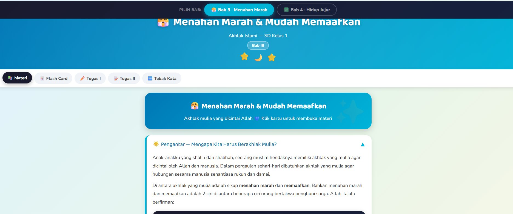
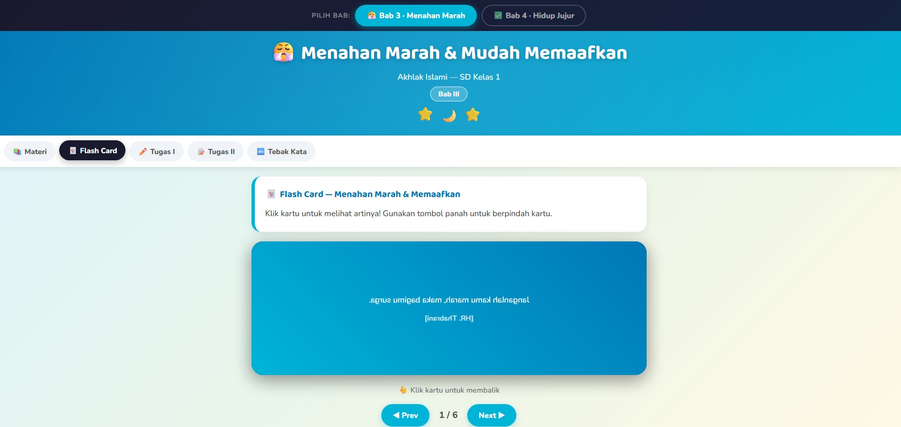
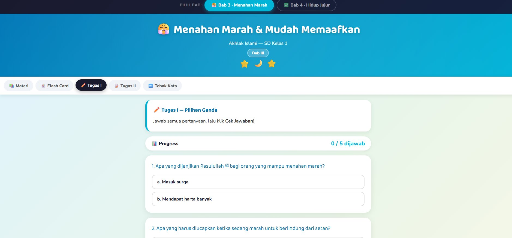
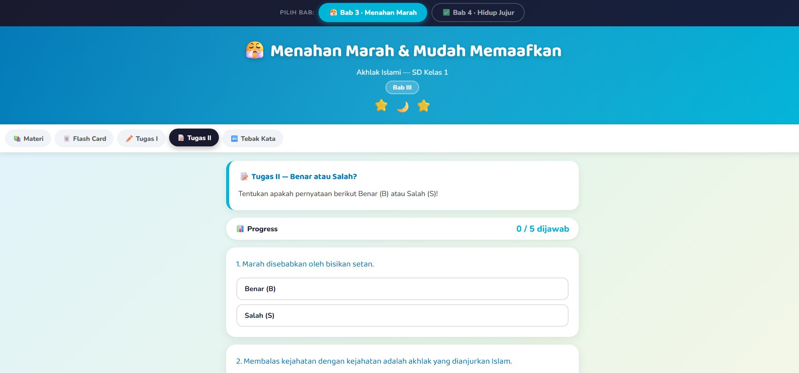

# 🌙 Akhlak Islami — SD Kelas 1

Aplikasi web interaktif untuk belajar Akhlak Islami Kelas 1 SD, mencakup Bab 3, Bab 4, dan Bab 5. Dirancang agar siswa bisa belajar mandiri dengan tampilan yang menarik, berwarna, dan responsif di desktop maupun mobile.

🔗 **[Buka Aplikasi — dannybudiman.github.io/LatihanAkhlakIslamiSD](https://dannybudiman.github.io/LatihanAkhlakIslamiSD/)**

---

## 📸 Tampilan Aplikasi

### Halaman Materi (Bab 3 — Menahan Marah)


### Flash Card Dalil


### Tugas I — Pilihan Ganda


### Tugas II — Benar atau Salah?


### Bab 4 — Hidup Jujur


---

## 📚 Konten Materi

| Bab | Judul | Warna Tema |
|-----|-------|-----------|
| Bab 3 | 😤 Menahan Marah & Mudah Memaafkan | Teal / Biru |
| Bab 4 | ✅ Yuk, Hidup Jujur! | Indigo / Ungu Biru |
| Bab 5 | 🌙 Aku Senang Berpuasa | Emerald / Hijau |

---

## ✨ Fitur

### 📖 Materi
Penjelasan materi lengkap dalam format accordion yang bisa dibuka-tutup. Dilengkapi kotak dalil Arab beserta terjemahannya, keutamaan dalam bentuk strip bernomor, dan langkah-langkah praktis dalam bentuk cloud steps.

**Bab 3 — Menahan Marah & Mudah Memaafkan:**
- 4 Keutamaan Menahan Amarah (lengkap dengan dalil Arab)
- 4 Cara Meredakan Marah
- Keutamaan Mudah Memaafkan + dalil Al-Quran
- 7 Cara agar Mudah Memaafkan

**Bab 4 — Yuk, Hidup Jujur!:**
- Pengertian Ash-Shidqu dan Al-kidzbu
- 5 Manfaat Hidup Jujur
- 5 Bahaya Sifat Dusta
- 7 Cara menjadi Orang Jujur

**Bab 5 — Aku Senang Berpuasa:**
- Arti Puasa (Shaum) + dalil QS. Al-Baqarah: 183
- 8 Keutamaan Puasa Ramadhan (lengkap dengan hadits Arab)
- 7 Tata Cara Berpuasa yang benar
- Doa berbuka puasa + Pembatal-pembatal Puasa

### 🃏 Flash Card
Kartu dalil dengan efek flip 3D. Sisi depan menampilkan ayat/dalil dalam tulisan Arab atau istilah, sisi belakang menampilkan arti dan penjelasan lengkap. Bisa dinavigasi maju-mundur. Tersedia **6 kartu per bab**.

### ✏️ Tugas I — Kuis Pilihan Ganda
Soal pilihan ganda (a/b) sebanyak 5 soal per bab. Tersedia feedback langsung (✅ Benar / ❌ Salah) setelah dicek, beserta skor akhir dan pesan motivasi.

### 📝 Tugas II — Benar atau Salah?
Pernyataan yang harus ditentukan Benar (B) atau Salah (S), sebanyak 5 soal per bab. Dilengkapi koreksi otomatis dan skor akhir.

### 🔤 Tebak Kata (Word Match)
Aktivitas mencocokkan kata/istilah ke kategori yang tepat. Pilih kata di kolom kiri, lalu klik kategori di kolom kanan. Jika salah, kartu akan bergetar (efek shake). Semua pasangan yang sudah cocok ditampilkan di bagian atas.

- **Bab 3:** Mencocokkan kata ke kategori Akhlak Terpuji, Akhlak Tercela, Wasiat Nabi, Cara Meredakan
- **Bab 4:** Mencocokkan kata ke kategori Istilah Jujur, Istilah Dusta, Manfaat Jujur, Bahaya Dusta, Gelar Nabi
- **Bab 5:** Mencocokkan kata ke kategori Keutamaan Puasa, Pembatal Puasa, Syarat Puasa, Sunnah Puasa

---

## 🗂️ Struktur File

```
index.html       # File tunggal, semua CSS + JS + konten di dalam satu file
ss_materi.png    # Screenshot halaman materi Bab 3
ss_flashcard.png # Screenshot fitur Flash Card
ss_tugas1.png    # Screenshot Tugas I (pilihan ganda)
ss_tugas2.png    # Screenshot Tugas II (benar/salah)
ss_bab4.png      # Screenshot Bab 4 (Hidup Jujur)
README.md        # Dokumentasi ini
```

---

## 🚀 Cara Penggunaan

Tidak perlu instalasi apapun. Cukup buka file `index.html` di browser (Chrome, Firefox, Edge, Safari).

```
Klik dua kali pada index.html
```

Atau untuk membuka via terminal:

```bash
# Linux / macOS
open index.html

# Windows
start index.html
```

> **Catatan:** Font Google Fonts (Baloo 2 & Nunito) memerlukan koneksi internet untuk tampil optimal. Aplikasi tetap berfungsi secara offline, hanya font akan fallback ke sans-serif default.

---

## 🛠️ Teknologi

- **HTML5** — Struktur dan konten
- **CSS3** — Styling, animasi (keyframes), CSS variables, responsive layout
- **Vanilla JavaScript** — Logika interaktif, state management, render dinamis
- **Google Fonts** — Baloo 2 & Nunito

Tidak menggunakan framework atau library eksternal apapun — 100% native HTML/CSS/JS dalam satu file.

---

## 📱 Responsif

Tampilan otomatis menyesuaikan layar mobile dengan ukuran font dan padding yang lebih kecil. Nav tab bisa di-scroll horizontal jika konten melebihi lebar layar.

---

## 👨‍🏫 Kredit

Dibuat untuk pembelajaran Akhlak Islami SD Kelas 1. Konten materi bersumber dari buku teks Akhlak Islami SD Kelas 1.
